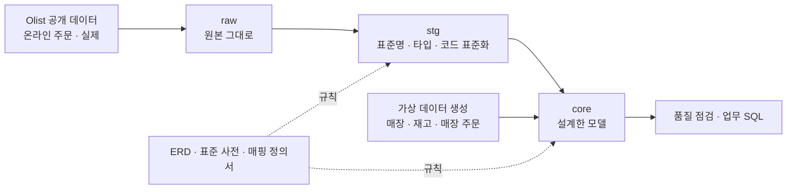
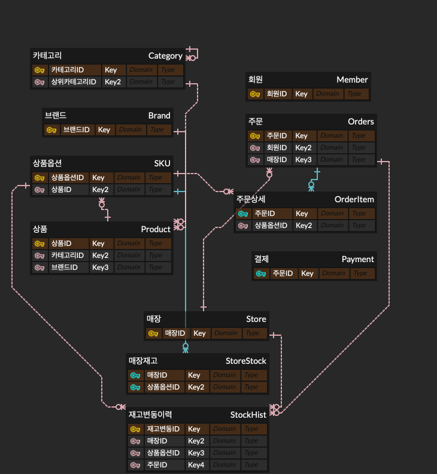
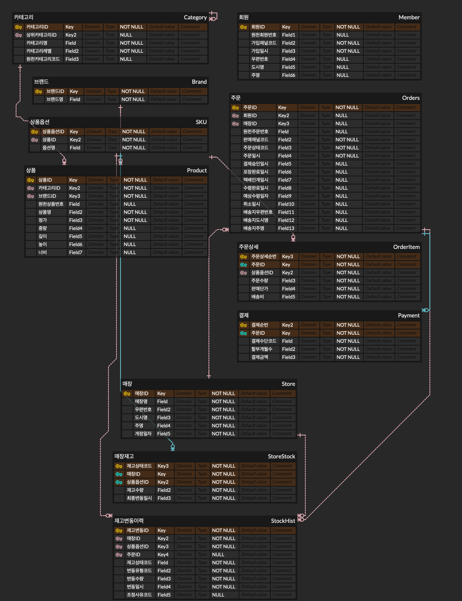
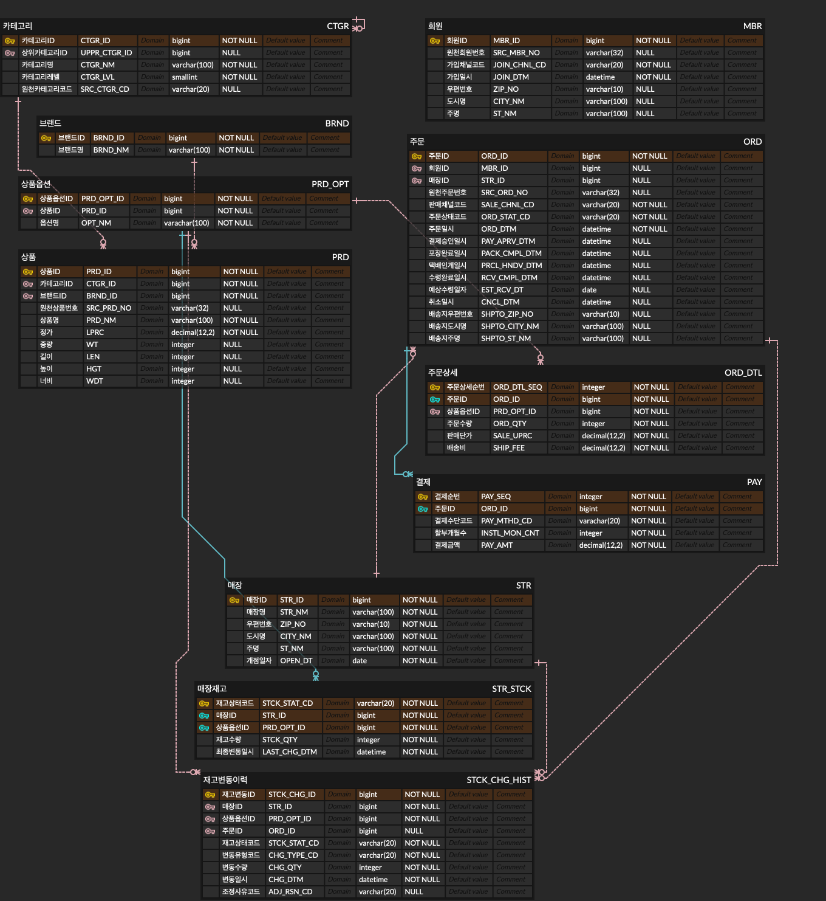

# 온·오프라인 통합 리테일 데이터 모델 설계 및 데이터 표준·품질 관리 체계 구축

> 매장 판매직 약 2년 7개월 현장 경험을 근거로 온·오프라인 통합 리테일 데이터 모델을 설계하고,
> 공개 이커머스 데이터를 이관해 표준 준수와 품질을 검증한 데이터 아키텍처 프로젝트입니다. 

| 구분 | 내용 |
|---|---|
| 범위 | 개념·논리·물리 모델링, 데이터 표준 정의, 원천 이관(raw → stg → core), 품질 점검, 업무 SQL |
| 도구 | MySQL 8.0, DBeaver, ERDCloud, Python (pandas, pymysql), Excel |
| 설정 | 오프라인 매장과 온라인몰을 함께 운영하는 가상의 헬스·뷰티 리테일 기업 |

---

## 1. 프로젝트 배경: 현장에서 겪은 문제

대형 헬스·뷰티 리테일 매장에서 판매직으로 근무하며, 입고·판매·온라인 주문 출고가 전산에 정확히 기록되는 환경에서도 **전산 재고와 실물 재고가 맞지 않는 상황**을 반복해서 겪었습니다.

원인은 시스템 오류가 아니라 **전산에 기록되지 않는 실물의 상태**였습니다.

- **매장 픽업 주문이 포장 완료 후 취소되는 경우:** 전산 재고는 취소 즉시 판매 가능으로 복원되지만, 실물은 포장 봉투 안에 그대로 남습니다. 취소 사실을 모르는 상태에서 고객이 그 상품을 찾으면, 전산에는 재고가 있는데 진열대에는 없어 찾는 데 오랜 시간이 걸렸습니다. 영업 마감 후 취소된 건은 다음 날 봉투를 하나씩 확인해야 했고, 할인 행사 기간에는 이런 봉투가 크게 늘었습니다.
- **재고 실사 조정 사유:** 상품이 보이지 않으면 원인을 모르는 상태에서 조정 사유를 골라야 했기에 '포스 오류'를 기본값처럼 선택하고, 나중에 찾으면 다시 수정했습니다. 조정 사유 데이터가 실제 원인을 반영하지 못했습니다.

이 프로젝트는 **"시스템이 잘 되어 있어도 실물과 전산의 차이는 생기며, 그 차이를 추적할 수 있는 구조가 필요하다"** 는 문제 정의에서 출발했습니다.

---

## 2. 핵심 설계 결정

설계 과정의 모든 결정은 [설계 의사결정 기록](01_design/decision_log.md)에 고민 지점, 선택지, 판단 근거와 함께 26건으로 기록했습니다. 그중 핵심은 다음과 같습니다.

| 결정 | 내용 | 근거 |
|---|---|---|
| 재고를 상태별로 관리 (D-002) | 매장재고를 매장·상품·**재고상태**(가용 / 주문보관 / 테스터) 단위로 저장 | 픽업 주문 보관품이 전산 어디에도 보이지 않던 문제 해결 |
| 취소 재고의 처리 (D-006, 변경 1회) | 취소 시 가용 재고는 즉시 복원하고, **포장완료 후 취소된 주문을 조회해 "취소 봉투 확인 대상"으로 안내** | 처음엔 재진열 전 판매를 막는 안을 검토했으나, 현장의 실제 문제는 판매 여부가 아니라 위치를 모르는 것이었고 행사 기간의 재진열 입력은 부담이 크다고 판단 |
| 재고변동이력 (D-021) | 모든 재고 변동을 유형·사유·원인 주문과 함께 기록 | 매장재고 = 이력 누적 합계로 정합성 점검, 과거 시점 재고 재계산 가능 |
| 회원 식별자 (D-011) | 원천의 주문별 고객번호가 아닌 **실제 사람 단위 번호**로 회원 통합 | 원천 확인 결과 동일인 2,997명이 여러 번호로 분리되어 있었음 |
| 채널 통합 (D-017) | 매장판매·택배배송·매장출고배송·매장픽업을 **주문 단일 테이블 + 채널코드**로 통합 | 온·오프라인 통합 조회가 프로젝트의 목적 |

---

## 3. 데이터 구성과 아키텍처



| 계층 | 역할 |
|---|---|
| raw | CSV 원본을 컬럼명·값 변경 없이 모두 문자형으로 적재. 원본과 대조할 기준 보존 |
| stg | 원천 1행 = 1행 구조를 유지하며 표준 물리명, 타입 변환, 빈 값 → NULL, 코드 표준화, 이관 대상 필터 |
| core | 설계한 모델 구조로 재구성. 대체키 생성, 수량 집계, 회원·주소 조회 |

| 데이터 | 출처 | 규모 |
|---|---|---|
| 온라인 택배배송 주문, 회원, 상품, 결제 | Olist 공개 데이터 (health_beauty 단독 주문) | 주문 8,764건 |
| 매장, 매장재고, 재고변동이력, 매장판매·매장출고배송·매장픽업 주문 | 가상 데이터 (Python 시뮬레이션) | 주문 13,562건 |
| 브랜드, 상품명, 카테고리 중분류 | 가상 데이터 (원천에 없음) | 브랜드 20개, 중분류 6개 |

---

## 4. 데이터 모델

### 개념 · 논리 · 물리 ERD

| 개념 | 논리 | 물리 |
|---|---|---|
|  |  |  |

엔터티 11개: 회원, 브랜드, 카테고리(자기참조), 상품, 상품옵션(SKU), 매장, 매장재고, 재고변동이력, 주문, 주문상세, 결제

### 부모가 없어도 되는 관계 (FK NULL 허용)

| 테이블 | FK | 이유 |
|---|---|---|
| 카테고리 | 상위카테고리ID | 대분류는 상위가 없음 |
| 주문 | 회원ID | 매장 비회원 결제 (D-018) |
| 주문 | 매장ID | 택배배송은 출고매장 없음 (D-017) |
| 재고변동이력 | 주문ID | 입고·실사조정은 원인 주문 없음 (D-021) |

### 주요 코드 흐름

- 픽업·매장출고 주문: 접수 → **주문할당**(가용 → 주문보관) → 포장완료 → **주문수령**(주문보관 −) 또는 **주문취소복원**(주문보관 → 가용)
- 부분 취소 불가, 봉투 1개 = 주문 1개를 전제로 처리 상태는 주문 단위로 관리 (D-004)

---

## 5. 데이터 표준

[표준 사전](02_standards/data_standard_dictionary.xlsx): 표준단어 57개, 표준도메인 14개, 표준용어 57개, 표준코드 35개

**명명 규칙**
- 물리명은 표준단어의 영문 약어를 밑줄로 연결 (주문 + 일시 = `ORD_DTM`)
- 모든 표준용어는 분류어(ID, 번호, 코드, 명, 일시, 금액, 수량 등)로 끝나며, 분류어가 도메인을 결정
- 같은 의미의 단어는 하나만 표준으로 두고 나머지는 금칙어로 등록
- 사전·ERD는 대문자, MySQL에는 소문자로 생성하고 한글 논리명은 컬럼 COMMENT로 기록 (D-025)

| 표준용어 | 물리명 | 도메인 | 타입 |
|---|---|---|---|
| 주문일시 | ORD_DTM | DTM | DATETIME |
| 판매단가 | SALE_UPRC | AMT_N12_2 | DECIMAL(12,2) |
| 재고상태코드 | STCK_STAT_CD | CD_V20 | VARCHAR(20) |
| 수령완료일시 | RCV_CMPL_DTM | DTM | DATETIME |
| 원천주문번호 | SRC_ORD_NO | NO_V32 | VARCHAR(32) |

**용어 결정 사례 (D-022):** 택배 배송완료와 픽업 수령완료를 하나의 속성으로 통합하면서 '인도', '도착', '수령'을 비교했습니다. '인도'는 현업에서 잘 쓰지 않고, '도착'은 고객이 매장에 와서 받는 픽업에 맞지 않아, 모든 채널에 자연스러운 **'수령'**으로 정했습니다. 예상 값도 '예상수령일자'로 맞춰 실제 값과 비교 대상임이 이름에서 드러나게 했습니다.

**DBMS에 따른 도메인 조정 (D-025):** MySQL의 TIMESTAMP는 시간대 설정에 따라 조회 값이 바뀌고 2038년까지만 저장되어, 업무 일시 도메인은 DATETIME으로 정했습니다.

---

## 6. 원천 이관

[매핑 정의서](02_standards/mapping_spec.xlsx)에 원천 컬럼별 목표 컬럼, 변환 규칙, 적용 계층(stg/core), 관련 결정을 정의하고, 이관하지 않은 테이블·컬럼과 사유도 기록했습니다.

### 이관 대사 (stg ↔ core)

| 항목 | stg | core | 일치 |
|---|---:|---:|:---:|
| 상품 | 2,444 | 2,444 | Y |
| 회원 | 8,608 | 8,608 | Y |
| 주문 | 8,764 | 8,764 | Y |
| 주문 품목 수량 | 9,587 | 9,587 | Y |
| 주문 판매금액 | 1,250,402.83 | 1,250,402.83 | Y |
| 결제 | 9,037 | 9,037 | Y |

- 이관 대상 주문 8,764건은 Python(pandas) 탐색 결과와 SQL 필터 결과가 서로 다른 방법으로 일치했습니다.
- 원천의 반복 품목 행을 수량으로 묶어(D-013) 주문상세 행 수는 줄었지만, **수량 합계와 판매금액 합계는 원천과 정확히 같음**을 확인했습니다.
- 회원 8,608명 < 주문 8,764건: 한 사람의 여러 주문을 하나의 회원으로 통합한 결과입니다 (D-011).

### 이관 과정에서 발견한 원천 품질 이슈

전체 목록: [source_quality_issues.md](00_source/source_quality_issues.md)

| 이슈 | 발견 단계 | 처리 |
|---|---|---|
| 동일인이 주문마다 다른 고객번호를 가짐 (2,997명) | 탐색 | 사람 단위 번호로 회원 통합 |
| 상품 1개당 1행, 수량 컬럼 없음 | 탐색 | 수량으로 집계 |
| 한 파일만 윈도우 형식 줄바꿈 → 값 끝에 보이지 않는 문자 | **raw 적재 검증** | 행 수로는 드러나지 않아 값 점검 쿼리로 발견, 재적재 |
| 결제금액 ≠ 주문금액 23건, 결제 없는 주문 1건 | 품질 점검 | 이관 후 검출·보고 (D-020) |
| 처리 일시 순서가 뒤바뀐 주문 16건 | **품질 점검** | 탐색 단계에서는 몰랐던 이슈 |

원천 문제를 이관 전에 지우지 않고 **이관 후 품질 점검에서 검출**하도록 했습니다(D-020). 미리 지우면 점검 체계가 실제로 작동하는지 보여줄 수 없기 때문입니다.

---

## 7. 가상 데이터

원천에 없는 매장·재고 데이터는 [Python 시뮬레이션](04_data_gen/generate_store_data.py)으로 만들었습니다 (D-026).

- **시간 순 이벤트 시뮬레이션:** 입고, 판매, 주문할당, 포장, 수령, 취소, 실사조정을 실제 업무 순서대로 발생시켜 매장재고가 변동이력의 누적 결과와 일치합니다. 판매 가능 재고가 부족한 주문은 만들지 않아 어느 시점에도 음수 재고가 없습니다.
- **재현성:** 난수 시드를 고정해 몇 번을 실행해도 같은 데이터가 나옵니다.
- **원천 분포 활용:** 매장 위치를 원천 회원이 가장 많은 도시 상위 4곳으로 정했습니다.
- **현장 패턴 반영:** 할인 행사 기간 2회(온라인 주문 3배, 포장완료 후 취소율 증가), 포스오류 차감 후 2일 내 복원 등
- **검증용 주입:** 매장재고 5행에 이력 없는 수량 차이를 의도적으로 넣어, 품질 점검이 잡아내는지 확인했습니다.

| 매장 4개 | 매장 가입 회원 | 매장판매 | 매장픽업 | 매장출고배송 | 포장완료 후 취소 | 재고변동이력 |
|---|---:|---:|---:|---:|---:|---:|
| 상파울루, 리우데자네이루, 벨루오리존치, 브라질리아 | 800 | 9,708 | 2,535 | 1,319 | 396 | 41,078 |

---

## 8. 품질 점검 결과

[06_quality_check.sql](03_sql/06_quality_check.sql): 품질 차원별 17개 규칙

| 차원 | 점검 | 결과 |
|---|---|---|
| 완전성 | 채널별 회원·매장 필수, 조정사유 필수 등 (Q-01~04) | 모두 0건 |
| 완전성 | 취소 주문의 취소일시 없음 (Q-06) | 35건, 원천에 취소 시각 없음 (한계) |
| 유효성 | 표준코드에 없는 값, 0 이하 금액 (Q-07~08) | 0건 |
| 관계 | 주문상세 없는 주문 / 결제 없는 주문 (Q-09~10) | 0건 / 1건 (원천) |
| 유일성 | 수량 집계 누락 (Q-11) | 0건 |
| 정합성 | 결제금액 ≠ 주문금액 (Q-12) | 23건, **모두 원천 주문** |
| 정합성 | **매장재고 ≠ 재고변동이력 누적 (Q-13)** | **5건, 주입 목록과 정확히 일치** |
| 정합성 | 음수 재고, 취소 시 재고 복원 누락 (Q-14, Q-16) | 0건 |
| 정합성 | 일시 순서 위반 (Q-15) | 16건, 원천 |
| 정확성 | 실사조정 후 2일 내 복원 (Q-17) | 아래 참고 |

**Q-13 검증:** 가상 데이터 생성 시 주입한 5건 `(매장1, SKU 1051), (2, 99), (2, 1460), (4, 1108), (4, 1139)`과 점검 결과가 정확히 일치해, 이력 없이 바뀐 재고를 빠짐없이 그리고 그것만 검출함을 확인했습니다.

**Q-17 조정 사유의 정확성:**

| 조정 사유 | 차감 건수 | 2일 내 복원 | 비율 |
|---|---:|---:|---:|
| 포스오류 | 249 | 199 | 79.9% |
| 원인미상 | 42 | 0 | 0% |
| 도난추정 | 132 | 0 | 0% |
| 파손 | 16 | 0 | 0% |

'포스오류'로 기록된 차감의 대부분이 곧 복원되었다는 것은, 실제로는 **못 찾은 것**을 포스오류로 기록했을 가능성이 높다는 뜻입니다. 조정 사유 데이터를 원인 분석에 그대로 쓰면 안 된다는 판단 근거가 됩니다. 단, 매장 데이터는 현장 경험을 바탕으로 가정한 가상 데이터이므로 이 결과는 발견이 아니라 **점검 방법의 시연**입니다.

---

## 9. 업무 활용

[07_business_query.sql](03_sql/07_business_query.sql)

| 번호 | 업무 질문 | 가능하게 한 설계 |
|---|---|---|
| B-01 | 4개 채널의 월별 매출과 온라인 비중 | 주문 단일 테이블 + 채널코드 |
| B-02 | **전산에는 가용으로 보이지만 취소 봉투 안에 있을 수 있는 상품** | 포장완료·취소 일시, 재고변동이력 |
| B-03 | 할인 행사 기간의 포장완료 후 취소 증가 | 주문 처리 일시 |
| B-04 | 매장별 재고 차이 사유와 실제 손실 추정 | 조정 사유 + 이력 |
| B-05 | 택배만 쓰는 회원과 매장 채널까지 쓰는 회원 | 사람 단위 회원 통합 |

**B-02 취소 봉투 확인 목록**은 프로젝트의 출발점이 된 현장 문제에 대한 답입니다. 기준 시각에 포장완료 후 취소된 지 2일이 안 된 주문의 상품을 매장별로 보여주고, 같은 줄에 **그 시각의 전산 가용재고**를 재고변동이력으로 계산해 함께 보여줍니다. 직원이 새로 입력할 것 없이, 이미 기록되는 데이터만으로 "이 재고는 봉투부터 확인하라"고 안내할 수 있습니다.

<!-- 실행 결과 캡처를 여기에 추가 -->

---

## 10. 한계와 향후 확장

- **가상 데이터:** 매장 운영 패턴은 한 매장의 근무 경험에 근거한 가정입니다. 매장 관련 수치는 모델과 점검 방법의 시연이며 실제 현상의 발견이 아닙니다.
- **원천 구조:** Olist는 여러 판매자가 입점한 마켓플레이스이지만 이 프로젝트는 자사 단일 판매로 간주했습니다 (D-009). 원천에 취소 시각이 없어 온라인 취소 주문의 취소일시는 비어 있습니다.
- **통화·지역:** 원천과 맞추기 위해 브라질 지역, BRL 통화를 유지했습니다 (D-016).
- **결제금액 불일치:** 결제액이 주문액보다 큰 경우 할부 이자 포함 가능성이 있으나 추가 확인이 필요합니다.
- **향후 확장:** 진열 위치 관리(D-001), 재조정 시 원 조정 참조(D-007), 매장 단위 일괄 정리 완료 기록(D-006), 가격이력·회원등급이력, 부분 취소 지원(D-004)

---

## 11. 실행 방법

1. MySQL 8.0 준비, 로컬 파일 적재 허용: `SET GLOBAL local_infile = 1;` (클라이언트 쪽 `allowLoadLocalInfile=true`도 필요)
2. [Olist 데이터](https://www.kaggle.com/datasets/olistbr/brazilian-ecommerce)를 내려받아 한 폴더에 저장
3. `03_sql/` 파일을 순서대로 실행

| 순서 | 파일 | 내용 |
|---|---|---|
| 1 | 01_ddl_core.sql | core 테이블 생성 |
| 2 | 02_ddl_raw.sql | raw 테이블 생성 |
| 3 | 03_load_raw.sql | CSV 적재 (**파일 경로를 본인 폴더로 수정**) + 적재 검증 |
| 4 | 04_transform_stg.sql | raw → stg |
| 5 | 05_transform_core.sql | stg → core + 이관 대사 |
| 6 | 04_data_gen/generate_store_data.py | 가상 데이터 (`pip install pymysql cryptography`) |
| 7 | 06_quality_check.sql | 품질 점검 |
| 8 | 07_business_query.sql | 업무 SQL |

---

## 12. 저장소 구조

```
├── README.md
├── 00_source/
│   ├── 01_olist.ipynb                 원천 구조 탐색 (설계 결정의 근거 수치)
│   └── source_quality_issues.md       원천 품질 이슈 목록
├── 01_design/
│   ├── erd_conceptual.png / erd_logical.png / erd_physical.png
│   └── decision_log.md                설계 의사결정 기록 26건
├── 02_standards/
│   ├── data_standard_dictionary.xlsx  표준 사전 (단어·도메인·용어·코드)
│   └── mapping_spec.xlsx              원천-목표 매핑 정의서
├── 03_sql/                            DDL, 적재, 변환, 품질 점검, 업무 SQL
└── 04_data_gen/
    └── generate_store_data.py         가상 데이터 시뮬레이션
```

---

## 13. 데이터 출처

- **Olist 브라질 이커머스 공개 데이터** (Brazilian E-Commerce Public Dataset by Olist), Kaggle
  - 라이선스: (Kaggle 데이터 페이지의 표기를 확인해 기입)
  - 저장소에는 원본 CSV를 포함하지 않습니다.
- **가상 데이터:** 매장, 매장 가입 회원, 매장 채널 주문, 매장재고, 재고변동이력, 브랜드, 상품명, 카테고리 중분류
- 이 프로젝트의 기업 설정은 가상이며, 특정 기업의 데이터나 시스템과 무관합니다.
